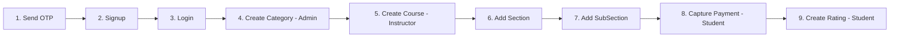

# 📘 Server API Documentation & Testing Guide

> **Base URL:** `http://localhost:4000`  
> **Server Status:** Running on port 4000 with MongoDB connected

---

## 🔐 Authentication Info

All **protected routes** require a JWT token. Send it via one of:

| Method | How to Send |
|---|---|
| **Cookie** | `token` cookie (set automatically on login) |
| **Header** | `Authorisation: Bearer <your_jwt_token>` |
| **Body** | `"token": "<your_jwt_token>"` in JSON body |

> [!IMPORTANT]
> The header name is `Authorisation` (British spelling), **NOT** `Authorization`.

### Account Types & Roles

| Role | Value | Access |
|---|---|---|
| Student | `"Student"` | Rating, Payment, Enrolled Courses |
| Instructor | `"Instructor"` | Create/Edit Courses, Sections, SubSections |
| Admin | `"Admin"` | Create Categories |

---

## 📋 Testing Workflow (Recommended Order)



---

## 1️⃣ Auth Routes — `/api/v1/auth`

---

### 1.1 Send OTP

| | |
|---|---|
| **URL** | `POST /api/v1/auth/sendotp` |
| **Auth** | ❌ None |
| **Content-Type** | `application/json` |

**Request Body:**
```json
{
  "email": "test@example.com"
}
```

**✅ Success Response (200):**
```json
{
  "success": true,
  "message": "OTP Sent Successfully",
  "otp": "123456"
}
```

**❌ Error (401) — User already registered:**
```json
{
  "success": false,
  "message": "User is Already Registered"
}
```

> [!TIP]
> Save the `otp` from the response — you'll need it for Signup.

---

### 1.2 Signup

| | |
|---|---|
| **URL** | `POST /api/v1/auth/signup` |
| **Auth** | ❌ None |
| **Content-Type** | `application/json` |

**Request Body:**
```json
{
  "firstName": "Vaibhav",
  "lastName": "Patel",
  "email": "test@example.com",
  "password": "password123",
  "confirmPassword": "password123",
  "accountType": "Student",
  "contactNumber": "9876543210",
  "otp": "123456"
}
```

> [!IMPORTANT]
> `accountType` must be one of: `"Student"`, `"Instructor"`, or `"Admin"`.

**✅ Success Response (200):**
```json
{
  "success": true,
  "user": { "...user object..." },
  "message": "User registered successfully"
}
```

**❌ Error Responses:**

| Status | Message |
|---|---|
| 403 | All Fields are required |
| 400 | Password and Confirm Password do not match |
| 400 | User already exists |
| 400 | The OTP is not valid |

---

### 1.3 Login

| | |
|---|---|
| **URL** | `POST /api/v1/auth/login` |
| **Auth** | ❌ None |
| **Content-Type** | `application/json` |

**Request Body:**
```json
{
  "email": "test@example.com",
  "password": "password123"
}
```

**✅ Success Response (200):**
```json
{
  "success": true,
  "token": "eyJhbGciOiJIUzI1NiIs...",
  "user": { "...user object with additionalDetails populated..." },
  "message": "User Login Success"
}
```

> [!TIP]
> **Save the `token`** — you need it for ALL protected API calls. Token expires in 24 hours.

**❌ Error Responses:**

| Status | Message |
|---|---|
| 400 | Please Fill up All the Required Fields |
| 401 | User is not Registered with Us |
| 401 | Password is incorrect |

---

### 1.4 Change Password

| | |
|---|---|
| **URL** | `POST /api/v1/auth/changepassword` |
| **Auth** | ✅ Required (any role) |
| **Content-Type** | `application/json` |

**Headers:**
```
Authorisation: Bearer <your_jwt_token>
```

**Request Body:**
```json
{
  "oldPassword": "password123",
  "newPassword": "newPassword456",
  "confirmNewPassword": "newPassword456"
}
```

**✅ Success Response (200):**
```json
{
  "success": true,
  "message": "Password updated successfully"
}
```

---

### 1.5 Reset Password Token (Request Reset Link)

| | |
|---|---|
| **URL** | `POST /api/v1/auth/reset-password-token` |
| **Auth** | ❌ None |
| **Content-Type** | `application/json` |

**Request Body:**
```json
{
  "email": "test@example.com"
}
```

**✅ Success Response (200):**
```json
{
  "success": true,
  "message": "Email Sent Successfully, Please Check Your Email to Continue Further"
}
```

---

### 1.6 Reset Password

| | |
|---|---|
| **URL** | `POST /api/v1/auth/reset-password` |
| **Auth** | ❌ None |
| **Content-Type** | `application/json` |

**Request Body:**
```json
{
  "password": "newPassword456",
  "confirmPassword": "newPassword456",
  "token": "<reset_token_from_email>"
}
```

**✅ Success Response (200):**
```json
{
  "success": true,
  "message": "Password Reset Successful"
}
```

---

## 2️⃣ Profile Routes — `/api/v1/profile`

> All routes in this section require authentication.

---

### 2.1 Get User Details

| | |
|---|---|
| **URL** | `GET /api/v1/profile/getUserDetails` |
| **Auth** | ✅ Required (any role) |

**Headers:**
```
Authorisation: Bearer <your_jwt_token>
```

**Request Body:** None

**✅ Success Response (200):**
```json
{
  "success": true,
  "message": "User Data fetched successfully",
  "data": { "...user object with profile populated..." }
}
```

---

### 2.2 Update Profile

| | |
|---|---|
| **URL** | `PUT /api/v1/profile/updateProfile` |
| **Auth** | ✅ Required (any role) |
| **Content-Type** | `application/json` |

**Headers:**
```
Authorisation: Bearer <your_jwt_token>
```

**Request Body:**
```json
{
  "dateOfBirth": "2000-01-15",
  "about": "I am a developer",
  "contactNumber": "9876543210"
}
```

**✅ Success Response (200):**
```json
{
  "success": true,
  "message": "Profile updated successfully",
  "profile": { "...updated profile object..." }
}
```

---

### 2.3 Update Display Picture

| | |
|---|---|
| **URL** | `PUT /api/v1/profile/updateDisplayPicture` |
| **Auth** | ✅ Required (any role) |
| **Content-Type** | `multipart/form-data` |

**Headers:**
```
Authorisation: Bearer <your_jwt_token>
```

**Form Data:**

| Key | Type | Value |
|---|---|---|
| `displayPicture` | File | Select an image file |

**✅ Success Response (200):**
```json
{
  "success": true,
  "message": "Image Updated successfully",
  "data": { "...updated user with new image URL..." }
}
```

---

### 2.4 Get Enrolled Courses

| | |
|---|---|
| **URL** | `GET /api/v1/profile/getEnrolledCourses` |
| **Auth** | ✅ Required (any role) |

**Headers:**
```
Authorisation: Bearer <your_jwt_token>
```

**Request Body:** None

**✅ Success Response (200):**
```json
{
  "success": true,
  "data": [ "...array of enrolled courses..." ]
}
```

---

### 2.5 Delete Profile (Account)

| | |
|---|---|
| **URL** | `DELETE /api/v1/profile/deleteProfile` |
| **Auth** | ✅ Required (any role) |

**Headers:**
```
Authorisation: Bearer <your_jwt_token>
```

**Request Body:** None

**✅ Success Response (200):**
```json
{
  "success": true,
  "message": "User deleted successfully"
}
```

> [!CAUTION]
> This **permanently deletes** the user account and associated profile. Cannot be undone.

---

## 3️⃣ Course Routes — `/api/v1/course`

---

### 3.1 Create Course

| | |
|---|---|
| **URL** | `POST /api/v1/course/createCourse` |
| **Auth** | ✅ Required — **Instructor only** |
| **Content-Type** | `multipart/form-data` |

**Headers:**
```
Authorisation: Bearer <instructor_jwt_token>
```

**Form Data:**

| Key | Type | Required | Description |
|---|---|---|---|
| `courseName` | Text | ✅ | Name of the course |
| `courseDescription` | Text | ✅ | Description |
| `whatYouWillLearn` | Text | ✅ | Learning outcomes |
| `price` | Text | ✅ | Price in INR |
| `tag` | Text | ✅ | Tag/label |
| `category` | Text | ✅ | Category ObjectId |
| `thumbnailImage` | File | ✅ | Course thumbnail image |
| `status` | Text | ❌ | `"Draft"` or `"Published"` (default: `"Draft"`) |
| `instructions` | Text | ❌ | Course instructions |

**✅ Success Response (200):**
```json
{
  "success": true,
  "data": { "...new course object..." },
  "message": "Course Created Successfully"
}
```

---

### 3.2 Get All Courses

| | |
|---|---|
| **URL** | `GET /api/v1/course/getAllCourses` |
| **Auth** | ❌ None |

**Request Body:** None

**✅ Success Response (200):**
```json
{
  "success": true,
  "data": [ "...array of courses with instructor populated..." ]
}
```

---

### 3.3 Get Course Details

| | |
|---|---|
| **URL** | `POST /api/v1/course/getCourseDetails` |
| **Auth** | ❌ None |
| **Content-Type** | `application/json` |

**Request Body:**
```json
{
  "courseId": "<course_object_id>"
}
```

**✅ Success Response (200):**
```json
{
  "success": true,
  "message": "Course Details fetched successfully",
  "data": { "...full course object with instructor, category, sections & subsections populated..." }
}
```

---

## 4️⃣ Section Routes — `/api/v1/course`

---

### 4.1 Create Section

| | |
|---|---|
| **URL** | `POST /api/v1/course/addSection` |
| **Auth** | ✅ Required — **Instructor only** |
| **Content-Type** | `application/json` |

**Headers:**
```
Authorisation: Bearer <instructor_jwt_token>
```

**Request Body:**
```json
{
  "sectionName": "Introduction",
  "courseId": "<course_object_id>"
}
```

**✅ Success Response (200):**
```json
{
  "success": true,
  "message": "Section created successfully",
  "updatedCourse": { "...course with sections & subsections populated..." }
}
```

---

### 4.2 Update Section

| | |
|---|---|
| **URL** | `POST /api/v1/course/updateSection` |
| **Auth** | ✅ Required — **Instructor only** |
| **Content-Type** | `application/json` |

**Headers:**
```
Authorisation: Bearer <instructor_jwt_token>
```

**Request Body:**
```json
{
  "sectionName": "Updated Section Name",
  "sectionId": "<section_object_id>"
}
```

**✅ Success Response (200):**
```json
{
  "success": true,
  "message": { "...updated section object..." }
}
```

---

### 4.3 Delete Section

| | |
|---|---|
| **URL** | `POST /api/v1/course/deleteSection` |
| **Auth** | ✅ Required — **Instructor only** |
| **Content-Type** | `application/json` |

**Headers:**
```
Authorisation: Bearer <instructor_jwt_token>
```

> [!WARNING]
> The controller reads `sectionId` from `req.params`, but the route is `POST`. You may need to send `sectionId` as a URL parameter or in the body for testing.

**Request Body:**
```json
{
  "sectionId": "<section_object_id>"
}
```

---

## 5️⃣ SubSection Routes — `/api/v1/course`

---

### 5.1 Create SubSection

| | |
|---|---|
| **URL** | `POST /api/v1/course/addSubSection` |
| **Auth** | ✅ Required — **Instructor only** |
| **Content-Type** | `multipart/form-data` |

**Headers:**
```
Authorisation: Bearer <instructor_jwt_token>
```

**Form Data:**

| Key | Type | Required | Description |
|---|---|---|---|
| `sectionId` | Text | ✅ | Parent section ObjectId |
| `title` | Text | ✅ | SubSection title |
| `description` | Text | ✅ | SubSection description |
| `video` | File | ✅ | Video file to upload |

**✅ Success Response (200):**
```json
{
  "success": true,
  "data": { "...updated section with subsections populated..." }
}
```

---

### 5.2 Update SubSection

| | |
|---|---|
| **URL** | `POST /api/v1/course/updateSubSection` |
| **Auth** | ✅ Required — **Instructor only** |
| **Content-Type** | `multipart/form-data` |

**Headers:**
```
Authorisation: Bearer <instructor_jwt_token>
```

**Form Data:**

| Key | Type | Required | Description |
|---|---|---|---|
| `sectionId` | Text | ✅ | SubSection ObjectId (used as ID) |
| `title` | Text | ❌ | New title |
| `description` | Text | ❌ | New description |
| `video` | File | ❌ | New video file |

---

### 5.3 Delete SubSection

| | |
|---|---|
| **URL** | `POST /api/v1/course/deleteSubSection` |
| **Auth** | ✅ Required — **Instructor only** |
| **Content-Type** | `application/json` |

**Headers:**
```
Authorisation: Bearer <instructor_jwt_token>
```

**Request Body:**
```json
{
  "subSectionId": "<subsection_object_id>",
  "sectionId": "<parent_section_object_id>"
}
```

**✅ Success Response (200):**
```json
{
  "success": true,
  "message": "SubSection deleted successfully"
}
```

---

## 6️⃣ Category Routes — `/api/v1/course`

---

### 6.1 Create Category

| | |
|---|---|
| **URL** | `POST /api/v1/course/createCategory` |
| **Auth** | ✅ Required — **Admin only** |
| **Content-Type** | `application/json` |

**Headers:**
```
Authorisation: Bearer <admin_jwt_token>
```

**Request Body:**
```json
{
  "name": "Web Development",
  "description": "All web development courses"
}
```

**✅ Success Response (200):**
```json
{
  "success": true,
  "message": "Categorys Created Successfully"
}
```

---

### 6.2 Show All Categories

| | |
|---|---|
| **URL** | `GET /api/v1/course/showAllCategories` |
| **Auth** | ❌ None |

**Request Body:** None

**✅ Success Response (200):**
```json
{
  "success": true,
  "data": [
    { "name": "Web Development", "description": "..." },
    { "name": "Machine Learning", "description": "..." }
  ]
}
```

---

### 6.3 Get Category Page Details

| | |
|---|---|
| **URL** | `POST /api/v1/course/getCategoryPageDetails` |
| **Auth** | ❌ None |
| **Content-Type** | `application/json` |

**Request Body:**
```json
{
  "categoryId": "<category_object_id>"
}
```

**✅ Success Response (200):**
```json
{
  "success": true,
  "data": {
    "selectedCategory": { "...category with courses..." },
    "differentCategories": [ "...other categories with courses..." ]
  }
}
```

---

## 7️⃣ Rating & Review Routes — `/api/v1/course`

---

### 7.1 Create Rating & Review

| | |
|---|---|
| **URL** | `POST /api/v1/course/createRating` |
| **Auth** | ✅ Required — **Student only** |
| **Content-Type** | `application/json` |

**Headers:**
```
Authorisation: Bearer <student_jwt_token>
```

**Request Body:**
```json
{
  "rating": 5,
  "review": "Excellent course!",
  "courseId": "<course_object_id>"
}
```

> [!NOTE]
> The student **must be enrolled** in the course to leave a review.

**✅ Success Response (200):**
```json
{
  "success": true,
  "message": "Rating and Review created Successfully",
  "ratingReview": { "...rating object..." }
}
```

---

### 7.2 Get Average Rating

| | |
|---|---|
| **URL** | `GET /api/v1/course/getAverageRating` |
| **Auth** | ❌ None |
| **Content-Type** | `application/json` |

**Request Body:**
```json
{
  "courseId": "<course_object_id>"
}
```

**✅ Success Response (200):**
```json
{
  "success": true,
  "averageRating": 4.5
}
```

---

### 7.3 Get All Reviews

| | |
|---|---|
| **URL** | `GET /api/v1/course/getReviews` |
| **Auth** | ❌ None |

**Request Body:** None

**✅ Success Response (200):**
```json
{
  "success": true,
  "message": "All reviews fetched successfully",
  "data": [ "...reviews with user & course info..." ]
}
```

---

## 8️⃣ Payment Routes — `/api/v1/payment`

---

### 8.1 Capture Payment (Create Razorpay Order)

| | |
|---|---|
| **URL** | `POST /api/v1/payment/capturePayment` |
| **Auth** | ✅ Required — **Student only** |
| **Content-Type** | `application/json` |

**Headers:**
```
Authorisation: Bearer <student_jwt_token>
```

**Request Body:**
```json
{
  "course_id": "<course_object_id>"
}
```

**✅ Success Response (200):**
```json
{
  "success": true,
  "courseName": "Web Development Bootcamp",
  "courseDescription": "...",
  "thumbnail": "https://...",
  "orderId": "order_xxxxxxxx",
  "currency": "INR",
  "amount": 49900
}
```

---

### 8.2 Verify Payment Signature (Webhook)

| | |
|---|---|
| **URL** | `POST /api/v1/payment/verifySignature` |
| **Auth** | ❌ None (Razorpay webhook) |
| **Content-Type** | `application/json` |

**Headers:**
```
x-razorpay-signature: <hmac_sha256_signature>
```

> [!NOTE]
> This endpoint is a **Razorpay webhook** callback. The webhook secret is `12345678`. It verifies the signature and auto-enrolls the student into the course.

**Request Body:** *(Sent by Razorpay)*
```json
{
  "payload": {
    "payment": {
      "entity": {
        "notes": {
          "courseId": "<course_object_id>",
          "userId": "<user_object_id>"
        }
      }
    }
  }
}
```

---

## 9️⃣ Health Check

| | |
|---|---|
| **URL** | `GET /` |
| **Auth** | ❌ None |

**✅ Success Response (200):**
```json
{
  "success": true,
  "message": "Your server is up and running...."
}
```

---

## 📊 Complete API Summary Table

| # | Method | Endpoint | Auth | Role | Content-Type |
|---|---|---|---|---|---|
| 1 | POST | `/api/v1/auth/sendotp` | ❌ | — | JSON |
| 2 | POST | `/api/v1/auth/signup` | ❌ | — | JSON |
| 3 | POST | `/api/v1/auth/login` | ❌ | — | JSON |
| 4 | POST | `/api/v1/auth/changepassword` | ✅ | Any | JSON |
| 5 | POST | `/api/v1/auth/reset-password-token` | ❌ | — | JSON |
| 6 | POST | `/api/v1/auth/reset-password` | ❌ | — | JSON |
| 7 | GET | `/api/v1/profile/getUserDetails` | ✅ | Any | — |
| 8 | PUT | `/api/v1/profile/updateProfile` | ✅ | Any | JSON |
| 9 | PUT | `/api/v1/profile/updateDisplayPicture` | ✅ | Any | Form-Data |
| 10 | GET | `/api/v1/profile/getEnrolledCourses` | ✅ | Any | — |
| 11 | DELETE | `/api/v1/profile/deleteProfile` | ✅ | Any | — |
| 12 | POST | `/api/v1/course/createCourse` | ✅ | Instructor | Form-Data |
| 13 | GET | `/api/v1/course/getAllCourses` | ❌ | — | — |
| 14 | POST | `/api/v1/course/getCourseDetails` | ❌ | — | JSON |
| 15 | POST | `/api/v1/course/addSection` | ✅ | Instructor | JSON |
| 16 | POST | `/api/v1/course/updateSection` | ✅ | Instructor | JSON |
| 17 | POST | `/api/v1/course/deleteSection` | ✅ | Instructor | JSON |
| 18 | POST | `/api/v1/course/addSubSection` | ✅ | Instructor | Form-Data |
| 19 | POST | `/api/v1/course/updateSubSection` | ✅ | Instructor | Form-Data |
| 20 | POST | `/api/v1/course/deleteSubSection` | ✅ | Instructor | JSON |
| 21 | POST | `/api/v1/course/createCategory` | ✅ | Admin | JSON |
| 22 | GET | `/api/v1/course/showAllCategories` | ❌ | — | — |
| 23 | POST | `/api/v1/course/getCategoryPageDetails` | ❌ | — | JSON |
| 24 | POST | `/api/v1/course/createRating` | ✅ | Student | JSON |
| 25 | GET | `/api/v1/course/getAverageRating` | ❌ | — | JSON |
| 26 | GET | `/api/v1/course/getReviews` | ❌ | — | — |
| 27 | POST | `/api/v1/payment/capturePayment` | ✅ | Student | JSON |
| 28 | POST | `/api/v1/payment/verifySignature` | ❌ | — | JSON |
| 29 | GET | `/` | ❌ | — | — |
